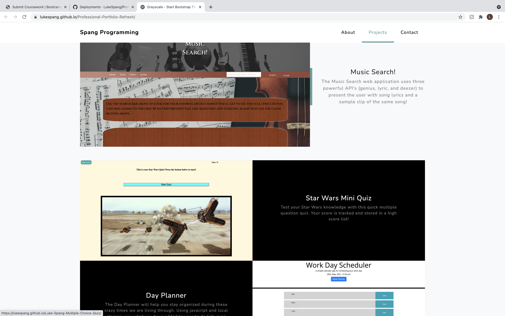

# Professional-Portfolio-Refresh

This application is a professional webpage portfolio for Luke Spang. This is an updated version from the original, now featuring a bootstrap template. Features include...
1. An active nav bar
2. Fun information about the developer
3. Three featured projects, with live links
4. A contact box (still needs to be set up for reception)
5. Contact information
6. Custom Github/LinkedIn links

The portfolio can be seen live at https://lukespang.github.io/Professional-Portfolio-Refresh/  and seen below in screen shots

